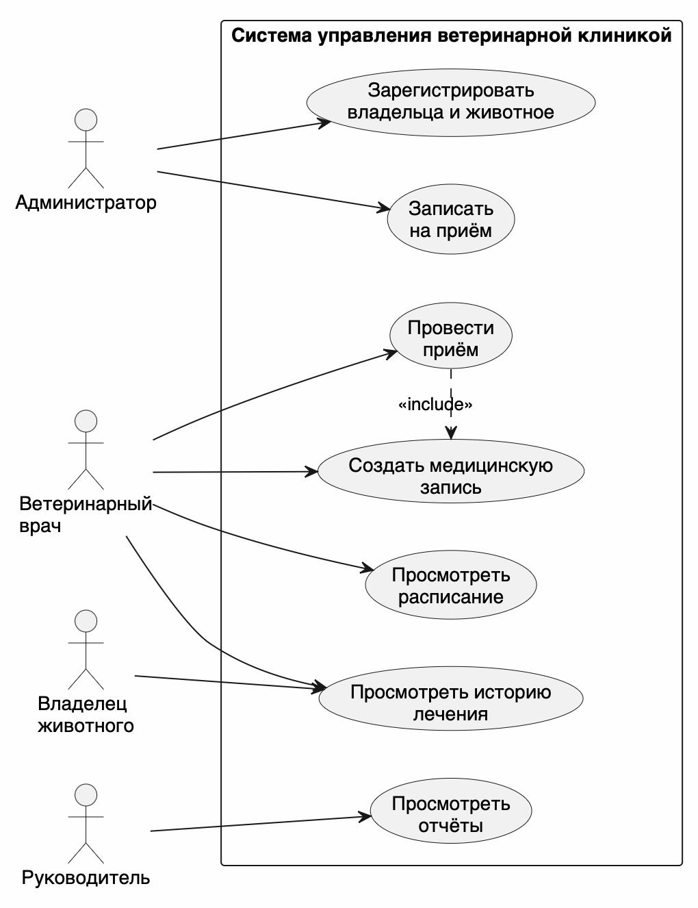
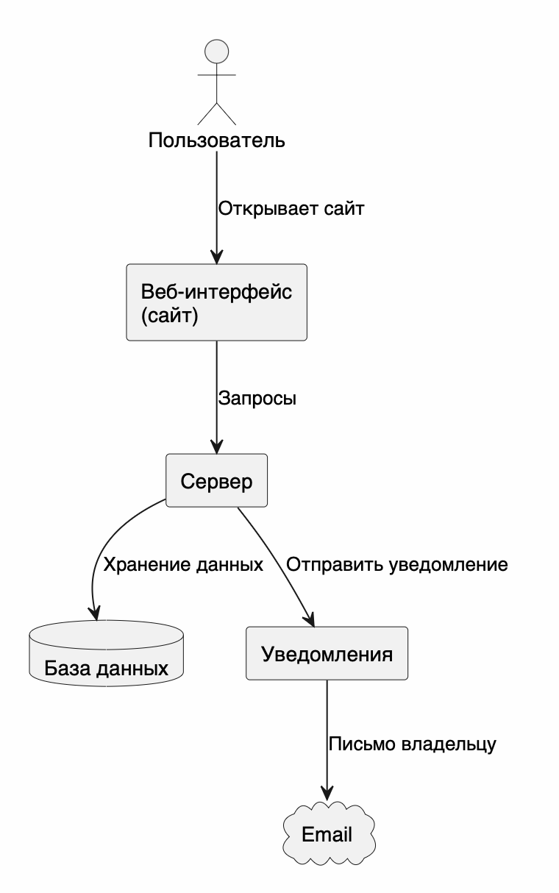

# Лабораторная работа №2
## Система управления ветеринарной клиникой

# 1. Описание системы

Система управления ветеринарной клиникой нужна для хранения информации о владельцах животных, животных, врачах, приёмах и медицинских записях.

Администратор регистрирует владельцев и животных, записывает животных к врачу и изменяет записи. Ветеринарный врач проводит приём и записывает диагноз, лечение и рекомендации.

Система нужна, чтобы не хранить всю информацию на бумаге и быстро находить историю лечения животного.

# 2. Пользователи и роли

| Роль | Что делает |
|---|---|
| Владелец животного | Смотрит данные своего животного и историю лечения |
| Администратор | Регистрирует владельцев и животных, записывает на приём |
| Ветеринарный врач | Проводит приём и создаёт медицинскую запись |
| Руководитель | Смотрит отчёты о работе клиники |

# 3. Сценарии использования

## 1. Регистрация владельца и животного

**Кто выполняет:** администратор.

1. Администратор открывает систему.
2. Вводит данные владельца: ФИО и телефон.
3. Добавляет животное: кличку, вид, породу и дату рождения.
4. Система сохраняет информацию.

**Результат:** владелец и его животное добавлены в систему.

## 2. Запись на приём

**Кто выполняет:** администратор.

1. Администратор выбирает животное.
2. Выбирает врача.
3. Выбирает дату и время приёма.
4. Система проверяет, свободен ли врач.
5. Система сохраняет запись.

**Результат:** животное записано на приём.

## 3. Просмотр расписания

**Кто выполняет:** ветеринарный врач.

1. Врач входит в систему.
2. Открывает своё расписание.
3. Видит список приёмов на выбранную дату.

**Результат:** врач знает, каких животных он будет принимать.

## 4. Проведение приёма

**Кто выполняет:** ветеринарный врач.

1. Врач открывает запись на приём.
2. Смотрит данные животного и историю лечения.
3. Проводит осмотр.
4. Вводит диагноз и рекомендации.
5. Сохраняет медицинскую запись.

**Результат:** результаты приёма сохранены в истории животного.

## 5. Просмотр истории лечения

**Кто выполняет:** ветеринарный врач или владелец животного.

1. Пользователь открывает карточку животного.
2. Выбирает раздел «История лечения».
3. Система показывает прошлые приёмы, диагнозы и назначения.

**Результат:** пользователь видит историю лечения животного.

# 4. Диаграмма вариантов использования

На диаграмме показано, что администратор регистрирует владельцев и животных, а также записывает на приём. Ветеринарный врач проводит приём и создаёт медицинскую запись. Владелец смотрит историю лечения. Руководитель смотрит отчёты.

# 5. Компоненты системы

| Компонент | Для чего нужен |
|---|---|
| Веб-интерфейс | Сайт, через который работают пользователи |
| Сервер | Обрабатывает запросы пользователей |
| База данных | Хранит владельцев, животных, врачей и приёмы |
| Сервис уведомлений | Отправляет сообщение о записи на приём |
| Почтовый сервис | Отправляет письма владельцам |

# 6. Диаграмма компонентов

Пользователь работает через веб-интерфейс. Веб-интерфейс отправляет запросы на сервер. Сервер получает и сохраняет данные в базе данных. При создании записи на приём сервер может отправить владельцу уведомление по электронной почте.

# 7. Концепция системы

Система является веб-приложением для ветеринарной клиники.

Основные возможности системы:

- Хранение информации о владельцах.
- Хранение информации о животных.
- Запись животных на приём.
- Просмотр расписания врачей.
- Создание медицинских записей.
- Хранение истории лечения.
- Просмотр отчётов.

Система имеет клиент-серверную архитектуру. Пользователь открывает сайт в браузере, сайт отправляет данные на сервер, а сервер работает с базой данных.
