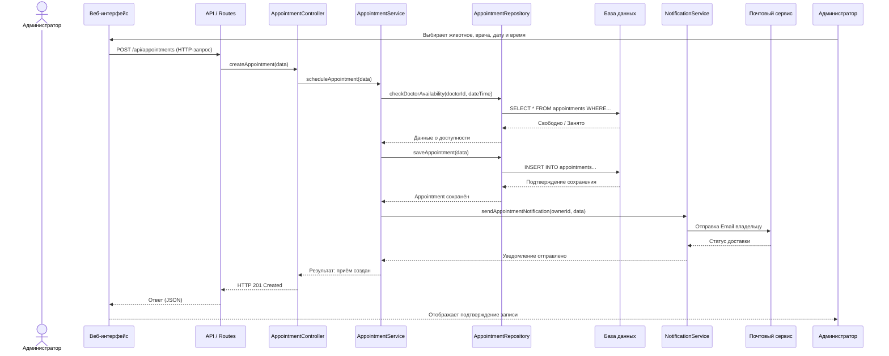
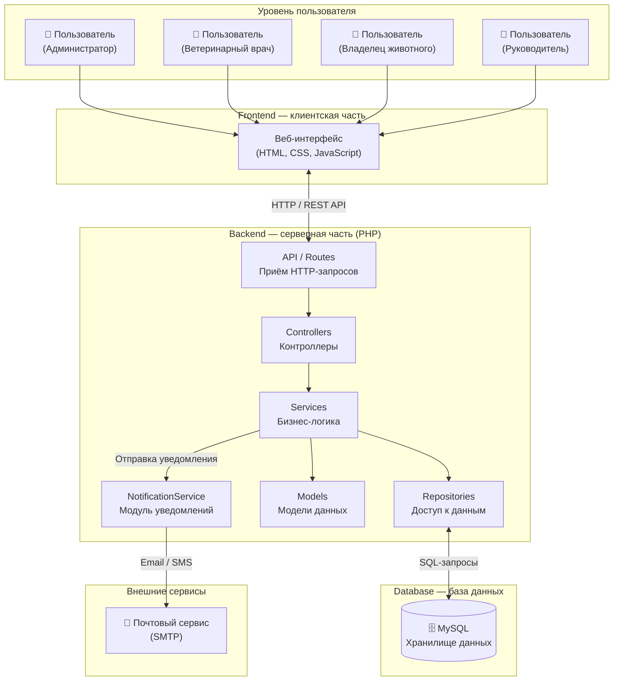

# Лабораторная работа №3. Проектирование архитектуры информационной системы

## Система управления ветеринарной клиникой

Выполнили: Парфенова Екатерина, Ярмуш Елена

---

## Цель работы

Изучить принципы проектирования архитектуры информационных систем, определить структуру приложения, спроектировать взаимодействие между основными компонентами и подготовить структуру программного проекта для дальнейшей разработки.

---

## Шаг 1. 
### Тип приложения

Веб-приложение с трёхуровневой архитектурой

### Основные уровни архитектуры

| Уровень | Назначение |
|---------|-----------|
| **Frontend** | Веб-интерфейс, с которым взаимодействует пользователь. Отвечает за отображение данных и приём пользовательского ввода |
| **Backend** | Обработка HTTP-запросов, бизнес-логика, проверка прав доступа, взаимодействие с базой данных и внешними сервисами. Реализован на PHP |
| **Database**| Постоянное хранение данных о владельцах, животных, врачах, приёмах и медицинских записях. СУБД — MySQL |

### Преимущества выбранного подхода

- Независимость уровней — каждый уровень можно разрабатывать, тестировать и масштабировать отдельно
-Чёткое разделение ответственности— логика представления, бизнес-логика и доступ к данным разделены
- Масштабируемость — при росте нагрузки можно масштабировать backend и database независимо
- Безопасность — пользователи не имеют прямого доступа к базе данных

---

## Шаг 2

### Компоненты системы и их ответственность

| Компонент | Уровень | Назначение и ответственность |
|-----------|---------|------------------------------|
| **Веб-интерфейс** | Frontend | Отображение страниц, таблиц, приём ввода от пользователя, отправка HTTP-запросов на сервер |
| **API / Routes** | Backend | Маршрутизация входящих HTTP-запросов к соответствующим контроллерам |
| **Контроллеры**  | Backend | Приём запросов, валидация входных данных, вызов сервисов, формирование HTTP-ответа |
| **Сервисы**| Backend | Бизнес-логика: регистрация владельцев, запись на приём, создание медицинских записей, формирование отчётов |
| **Репозитории**| Backend | Доступ к данным: выполнение SQL-запросов к базе данных |
| **Модели** | Backend | Описание структуры данных предметной области |
| **Модуль уведомлений** | Backend | Отправка уведомлений владельцам о записи на приём |
| **База данных** | Database | Хранение данных |
| **Почтовый сервис** | Внешний | Внешний сервер для отправки email-уведомлений |

---

## Шаг 30

### Направление передачи данных

```
Пользователь → Frontend → API → Controller → Service → Repository → Database
                                                          ↓
                                                   NotificationService → Почтовый сервис
```

### Последовательность обработки пользовательского запроса

1. **Пользователь** взаимодействует с **Веб-интерфейсом** (заполняет форму, нажимает кнопку)
2. **Веб-интерфейс** отправляет HTTP-запрос на **API / Routes**
3. **API / Routes** перенаправляет запрос в соответствующий **Контроллер**
4. **Контроллер** проверяет входные данные и вызывает нужный **Сервис**
5. **Сервис** выполняет бизнес-логику и обращается к **Репозиторию** для чтения/записи данных
6. **Репозиторий** выполняет SQL-запрос к **Базе данных** и возвращает результат
7. Если сценарий предполагает отправку уведомления, **Сервис** вызывает **NotificationService**, который обращается к внешнему почтовому сервису
8. Результат возвращается по цепочке обратно: **Сервис → Контроллер → API → Веб-интерфейс → Пользователь**

### Взаимодействие с внешними сервисами

При записи животного на приём **Сервис записи** вызывает **NotificationService**, который отправляет email-уведомление владельцу животного через внешний SMTP-сервер. Это взаимодействие происходит асинхронно и не блокирует основной поток обработки запроса

### Диаграмма взаимодействия (Sequence Diagram)

Сценарий: **Запись животного на приём с отправкой уведомления владельцу**.



---

## Шаг 4.

### Описание особенности

**Модуль уведомлений** — отправка email-уведомлений владельцам животных при записи на приём.

Эта особенность важна для ветеринарной клиники, потому что:

- Владелец животного должен знать о дате и времени приёма, чтобы не пропустить его
- Уведомление снижает количество пропущенных приёмов и оптимизирует загрузку врачей
- Бумажные журналы и телефонные звонки не обеспечивают надёжного информирования владельцев

### Компонент, отвечающий за реализацию

| Компонент | Назначение |
|-----------|-----------|
| **NotificationService** | Серверный модуль, который формирует текст уведомления и отправляет его через внешний почтовый сервис (SMTP) владельцу животного при создании, переносе или отмене приёма |

### Отражение в архитектуре

NotificationService выделен как отдельный компонент на уровне Backend (см. диаграмму архитектуры ниже). Он вызывается сервисами (AppointmentService) после сохранения данных о приёме в базе данных. На диаграмме взаимодействия показан вызов NotificationService и обращение к внешнему почтовому сервису.

---

## Шаг 5. Структура проекта

```
lab3/
├── README.md                          # Отчёт по лабораторной работе
├── diagrams/                          # Диаграммы (Mermaid)
│   ├── architecture.mmd               # Диаграмма архитектуры
│   └── sequence_appointment_notification.mmd  # Диаграмма взаимодействия
├── images/                            # Иллюстрации (при наличии)
├── src/                               # Исходный код проекта
│   ├── frontend/                      # Клиентская часть
│   ├── backend/                       # Серверная часть (PHP)
│   │   ├── controllers/              # Контроллеры
│   │   ├── services/                 # Сервисы (бизнес-логика)
│   │   ├── repositories/             # Репозитории (доступ к данным)
│   │   ├── models/                   # Модели данных
│   │   └── routes/                   # Маршруты API
│   ├── database/                      # SQL-скрипты и миграции
│   └── docs/                          # Дополнительная документация
```

### Назначение каталогов

| Каталог | Назначение |
|---------|-----------|
| `frontend/` | HTML-шаблоны, CSS-стили, JavaScript-скрипты клиентской части |
| `backend/controllers/` | Контроллеры для обработки HTTP-запросов (AppointmentController, OwnerController и др.) |
| `backend/services/` | Сервисы с бизнес-логикой (AppointmentService, NotificationService и др.) |
| `backend/repositories/` | Репозитории для доступа к данным (AppointmentRepository, OwnerRepository и др.) |
| `backend/models/` | Модели данных предметной области (Owner, Animal, Doctor, Appointment, MedicalRecord) |
| `backend/routes/` | Определение маршрутов API (REST-эндпоинты) |
| `database/` | SQL-скрипты создания таблиц, начальные данные |
| `docs/` | Дополнительная документация (описание API и др.) |

---

## Шаг 6. Архитектурные схемы

### Диаграмма архитектуры системы



\\\

### Диаграмма взаимодействия компонентов

Диаграмма взаимодействия представлена в шаге 3 и показывает сценарий записи животного на приём с отправкой уведомления владельцу

---

## Описание API

### Основные REST-эндпоинты

| Метод | URL | Описание | Роль |
|-------|-----|----------|------|
| `POST` | `/api/owners` | Регистрация нового владельца | Администратор |
| `POST` | `/api/animals` | Добавление животного | Администратор |
| `GET` | `/api/animals?ownerId=` | Получение списка животных владельца | Администратор, Врач |
| `POST` | `/api/appointments` | Запись животного на приём | Администратор |
| `PUT` | `/api/appointments/{id}` | Перенос приёма | Администратор |
| `DELETE` | `/api/appointments/{id}` | Отмена приёма | Администратор |
| `GET` | `/api/appointments?doctorId=&date=` | Получение расписания врача | Врач, Администратор |
| `GET` | `/api/animals/{id}/history` | Просмотр истории лечения животного | Врач, Владелец |
| `POST` | `/api/medical-records` | Создание медицинской записи | Врач |
| `PUT` | `/api/medical-records/{id}` | Редактирование медицинской записи | Врач |
| `GET` | `/api/reports` | Получение отчётов | Руководитель |

### Формат запроса (пример)

**POST /api/appointments**

```json
{
  "animalId": 15,
  "doctorId": 7,
  "date": "2026-10-05",
  "time": "14:30",
  "reason": "Плановый осмотр"
}
```

### Формат ответа (пример)

```json
{
  "id": 42,
  "status": "scheduled",
  "message": "Приём успешно создан. Уведомление отправлено владельцу"
}
```

---

## Вывод

В ходе лабораторной работы спроектирована архитектура информационной системы управления ветеринарной клиникой на основе трёхуровневой модели, выделены основные компоненты: контроллеры, сервисы, репозитории, модели, а также модуль уведомлений отвечающий за отправку email-уведомлений владельцам при записи на приём. Разработаны диаграммы архитектуры и взаимодействия, определена структура проекта и описан REST API. Полученная архитектура обеспечивает чёткое разделение ответственности, независимость уровней и готовность к дальнейшей реализации системы.
